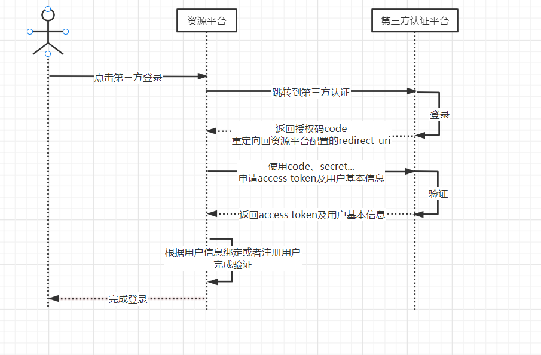

# 注意事项：

前后端一体时，可由后端独立完成 redirect_uri 为后端接口地址。
- toOauthLogin  跳转第三方平台 [后端]
- getOauthToken 使用code、secret...申请access token及用户基本信息 根据用户信息绑定或者注册用户完成验证  跳转首页[后端]

前后端分离时，由前后端一起完成  redirect_uri 为前端路由
- toOauthLogin  跳转第三方平台 [前端]
- getOauthToken 使用code、secret...申请access token及用户基本信息  [前端]
- 根据用户信息绑定或者注册用户完成验证 [后端]
- 跳转首页 [前端]